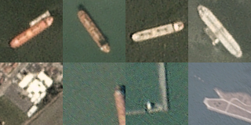
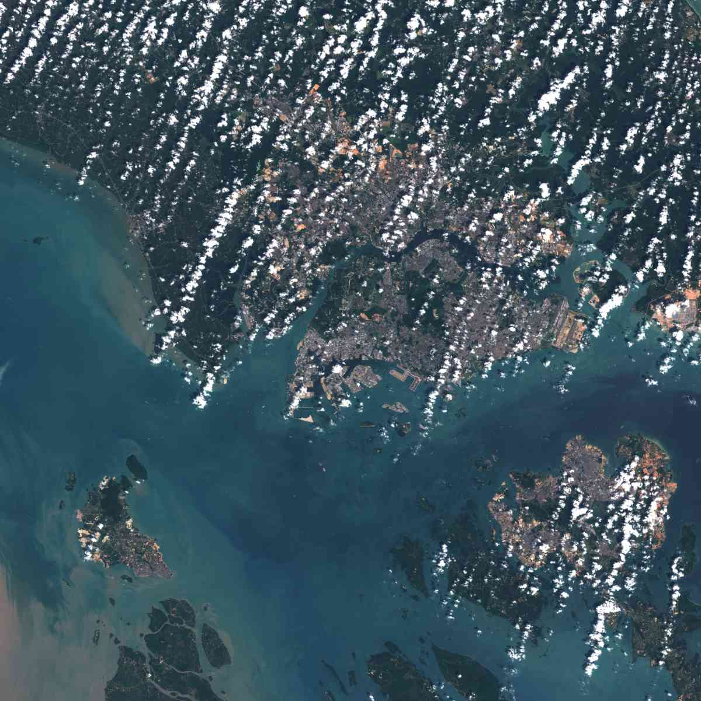
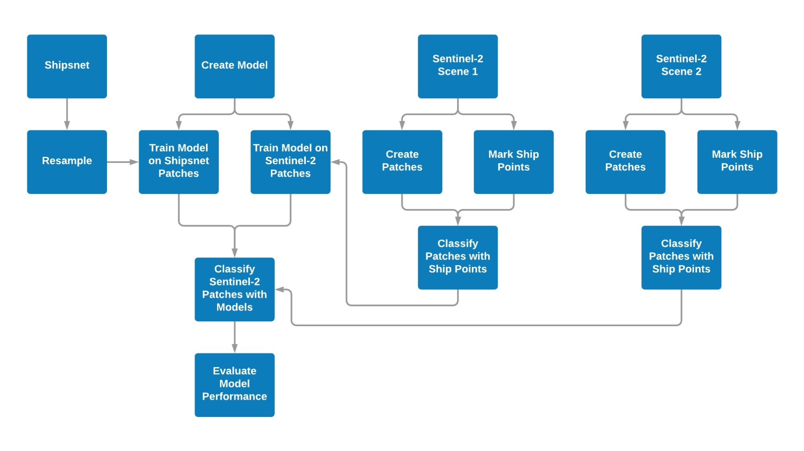
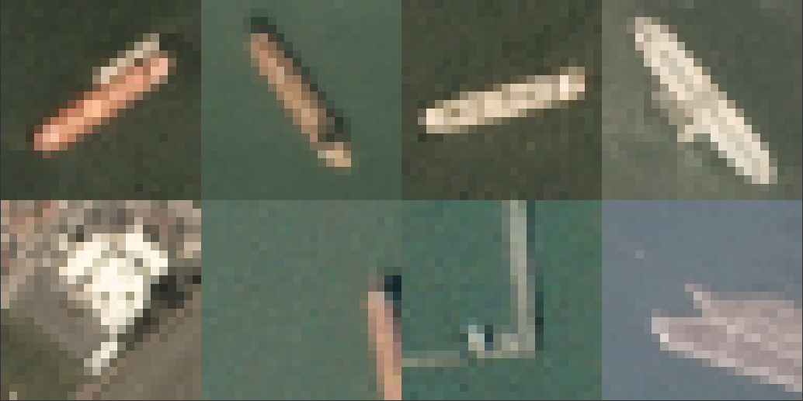

# Singapore-Ship-Detection
MUSA 650 final project for John Michael LaSalle, Madhura Gurav, and Eugene Chong.

# Introduction

In this project, we create a model for detecting large ships in Sentinel-2 imagery based on a training set of labeled PlanetScope images. Commercial ships use automatic identification systems (AIS) to broadcast their locations, but detecting ships in satellite imagery is useful for when [ships disable](https://www.nytimes.com/2020/04/30/world/europe/migrants-malta.html) their transponders to hide their locations. Identifying ships is also useful for tracking the [impacts of disruptions](https://www.bloomberg.com/news/articles/2020-04-27/oil-glut-swells-off-asian-trading-hub-on-global-storage-scramble) to maritime shipping.

There are a growing number of satellite imagery providers, including private companies like [Planet](https://www.planet.com/) or [DigitalGlobe](https://www.digitalglobe.com/products/satellite-imagery), and public programs like [Sentinel-2](https://sentinel.esa.int/web/sentinel/missions/sentinel-2) and [LandSat](https://www.usgs.gov/land-resources/nli/landsat), which collect imagery at different spatial and temporal resolutions. This has led to greater availability of data for researchers, but labeled training sets for machine learning do not exist for all of these providers, and creating them can be a time- and labor-intensive process. For our project, we wanted to investigate how well machine learning models, including support vector machines and convolutional neural networks, trained on imagery from one of these providers could generalize to imagery from another provider with a different spatial resolution. Through this work, we aimed to better understand how straightforward it would be for researchers to mix and match satellite imagery from various sources in machine learning models.

# Data

We started with Shipsnet, a [publicly available dataset of labeled](https://www.kaggle.com/rhammell/ships-in-satellite-imagery) ship images captured with Planet [PlanetScope](https://www.planet.com/products/monitoring/) satellites created by Bob Hammell. We accessed Shipsnet using the [Kaggle API](https://github.com/Kaggle/kaggle-api). Shipsnet has 4,000 patches, comprising 1,000 ship patches and 3,000 non-ship or partial ship patches.

_Figure 1. Shipsnet patches, ships above, not-ships below._

Shipsnet consists of 3-channel (RGB) images with a ground-sampling-distance of approximately 3 meters, meaning each 80x80 patch covers 57,600 square meters. The data are stored in a JSON file consisting of a flattened vector of 19,200 pixel values for each image and each image’s label. All the images come from the Port of Long Beach or the San Francisco Bay.

The data for our test set come from the European Space Agency’s Sentinel-2 program, which provides free access to 10-meter resolution imagery for the whole planet with frequent return intervals. Data is provided in 100 km by 100 km scenes with 13 bands. We chose Singapore for this project because it is covered by a single tile and is a major port with many ships.

_Figure 2. Sentinel-2 scene of tile 48NUG Showing Singapore._

We accessed Sentinel-2 using the [Copernicus Open Access Hub API](https://scihub.copernicus.eu/). We filtered the Sentinel-2 scenes down to those with less than 6% cloud cover that are available online, rather than in the Long-Term-Archive that has severe rate limits. This left us with three scenes of Singapore in total. The Sentinel-2 data is downloaded in a SAFE format, which contains a separate JPEG2000 file for each of the 13 bands and a 3-band RGB image. We extracted just the RGB images to match the Shipsnet dataset. We then created a validation dataset for the Sentinel-2 images by manually marking ship locations in QGIS and storing the points in a separate GeoJSON file for each scene. The number of marked ships is shown in the table below.

<table>
  <tr>
   <td><strong>Capture Date</strong>
   </td>
   <td>

<strong>Marked Ships</strong>

   </td>
  </tr>
  <tr>
   <td>2019-12-27
   </td>
   <td>

425

   </td>
  </tr>
  <tr>
   <td>2019-07-05
   </td>
   <td>

310

   </td>
  </tr>
  <tr>
   <td>2019-04-06
   </td>
   <td>

282

   </td>
  </tr>
</table>

_Table 1. Manually identified ships._

# Methods

All operations except for manually creating the ship points were done in a Jupyter Notebook run in Google Colab, with data stored in a Google Drive directory. Our process is shown in the chart below:

_Figure 3. Process Flowchart._

We resampled the Shipsnet patches to match the GSD of the Sentinel-2 imagery, creating patches of 32px by 32px. An exact conversion would have been a patch of 29.6px by 29.6px, but we chose 32 because it was the smallest size patch supported by the VGG16 model that we wanted to test for transfer learning.

_Figure 4. Resampled Shipsnet Patches_

We created Sentinel-2 patches matching the size of the Shipsnet patches, using an iterative approach that created 471,969 patches of 32px by 32px, with an overlap of 16px. We then used a spatial intersection to find the patches that intersect with the manually marked ship points, creating “ground-truth” labels to use to evaluate our model’s performance. In order to avoid cases where the ship point was on the edge of the patch, creating an intersection when the ship was not visible in the patch, we created a buffer from the centroid of the patchand used that to intersect to avoid literal edge cases.

<table>
  <tr>
   <td><strong>Name</strong>
   </td>
   <td>

<strong>Patches</strong>

   </td>
   <td>

<strong>“Ships”</strong>

   </td>
   <td>

<strong>“Not Ships”</strong>

   </td>
  </tr>
  <tr>
   <td>Shipsnet
   </td>
   <td>

4 000

   </td>
   <td>

1 000

   </td>
   <td>

3 000

   </td>
  </tr>
  <tr>
   <td>Sentinel Scene 1 (2019-12-27)
   </td>
   <td>

469 225

   </td>
   <td>

581

   </td>
   <td>

468 644

   </td>
  </tr>
  <tr>
   <td>Sentinel Scene 2 (2019-07-05)
   </td>
   <td>

469 265

   </td>
   <td>

448

   </td>
   <td>

468 777

   </td>
  </tr>
</table>

_Table 2. Data summary._

We created 3 different deep learning models architectures: a shallow convolutional network, a deep, more complex convolutional network, and a pre-trained model using [transfer learning](https://builtin.com/data-science/transfer-learning), as well as a Support Vector Machines model. For each of these models, we trained on a 60% stratified subset of the shipsnet patches, and tested on the remainder, going through several iterations to improve performance for that architecture. We augmented data for the deep learning model using rotation and zoom. The SVM model’s hyperparameters were optimized using grid search cross validation.

<table>
  <tr>
   <td><strong>Model</strong>
   </td>
   <td><strong>Description</strong>
   </td>
   <td>

<strong>Shipsnet test Accuracy</strong>

   </td>
  </tr>
  <tr>
   <td>1. SVM
   </td>
   <td>
<ul>

<li>Trained on flattened RGB vectors.

<li>Hyperparameters optimized using nested cross-validation and GridSearchCV
</li>
</ul>
   </td>
   <td>

Average of 94.5% across folds

   </td>
  </tr>
  <tr>
   <td>2. Shallow CNN
   </td>
   <td>
<ul>

<li>Trained on 32x32x3 tensors

<li>Only one hidden convolutional layer

<li>Some data augmentation (shearing, zooming, flipping)
</li>
</ul>
   </td>
   <td>

97.1%

   </td>
  </tr>
  <tr>
   <td>3. Deep CNN
   </td>
   <td>
<ul>

<li>Several convolutional/pooling layers and a hidden dense layer

<li>EarlyStopping and ReduceLRonPlateau callbacks

<li>More aggressive data augmentation (shifting, rotation, more shearing and zooming)
</li>
</ul>
   </td>
   <td>

96.1%

   </td>
  </tr>
  <tr>
   <td>4. CNN with Transfer Learning
   </td>
   <td>
<ul>

<li>Tried several pre-trained models for the convolutional base. <a href="https://github.com/liuzhuang13/DenseNet">DenseNet121</a> had best performance

<li>Overall, performance was much worse than simpler models
</li>
</ul>
   </td>
   <td>

79.3%

   </td>
  </tr>
</table>

_Table 3. Model summaries._

Once we had created the models, we also trained an identical model on a balanced subset of the Sentinel-2 data from one scene to create a benchmark for performance. Then we used both the Shipnet trained model and Sentinel-2 trained model to predict on a new Sentinel-2 scene.

# Results

Based on general experience with modeling approaches we would have expected SVM to perform the worst, followed by the shallow CNN, then deep CNN, with the CNN with transfer learning performing the best. This intuition did not hold true. While all the models had high accuracy due to the overwhelming prevalence of “not-ship” patches, the CNN with transfer learning performed th, this was a reflection of the overwhelming number of patches that are not ships.

The baseline models trained on Sentinel-2 data had lower accuracy and specificity than the Shipsnet trained models but much higher sensitivity. Specificity for all models was higher when trained with Sentinel-2 data, meaning that the model correctly classified ships as ships, but accuracy was lower because they also classified more “not-ships” as ships. The CNN with transfer learning had higher sensitivity with Shipsnet training data relative to the other models, but lower sensitivity when trained with Sentinel-2 data.

<table>
  <tr>
   <td><strong>Model</strong>
   </td>
   <td>

<strong>Accuracy</strong>

   </td>
   <td>

<strong>Specificity</strong>

   </td>
   <td>

<strong>Sensitivity</strong>

   </td>
   <td>

<strong>Precision</strong>

   </td>
  </tr>
  <tr>
   <td>1. SVM (Shipsnet)
   </td>
   <td>

0.9944

   </td>
   <td>

0.9955

   </td>
   <td>

0.0862

   </td>
   <td>
   </td>
  </tr>
  <tr>
   <td>1. SVM (Sentinel-2)
   </td>
   <td>
   </td>
   <td>
   </td>
   <td>
   </td>
   <td>
   </td>
  </tr>
  <tr>
   <td>2. Shallow CNN (Shipsnet)
   </td>
   <td>

0.9959

   </td>
   <td>

0.9971

   </td>
   <td>

0.069

   </td>
   <td>
   </td>
  </tr>
  <tr>
   <td>2. Shallow CNN (Sentinel-2)
   </td>
   <td>

0.8723

   </td>
   <td>

0.8723

   </td>
   <td>

0.9333

   </td>
   <td>
   </td>
  </tr>
  <tr>
   <td>3. Deep CNN (Shipsnet)
   </td>
   <td>

0.9953

   </td>
   <td>

0.9963

   </td>
   <td>

0.2069

   </td>
   <td>
   </td>
  </tr>
  <tr>
   <td>3. Deep CNN (Sentinel-2)
   </td>
   <td>

0.9826

   </td>
   <td>

0.9827

   </td>
   <td>

0.8222

   </td>
   <td>
   </td>
  </tr>
  <tr>
   <td>4. CNN with Transfer Learning (Shipsnet)
   </td>
   <td>

0.9397

   </td>
   <td>

0.9406

   </td>
   <td>

0.2241

   </td>
   <td>
   </td>
  </tr>
  <tr>
   <td>4. CNN with Transfer Learning (Sentinel-2)
   </td>
   <td>

0.8027

   </td>
   <td>

0.8031

   </td>
   <td>

0.4667

   </td>
   <td>
   </td>
  </tr>
</table>

_Table 4. Model Performance._

# Discussion

Overall, it is not easy to combine data sources and there are limits to an approach of transfer learning without any training on the new data.. The shipsnet data was not representative of all ships becuase it only included large cargo ships, limiting how effective the models could be. Downsampling images reduces model performance by obscuring features. Using only RGB bands makes differentiating between water and forest difficult.  False positives frequently had rectangular features and sharp lines that re visually similar to the Shipsnet ship patches.

Shallower models seemed to work better. Features learned in deeper models don’t translate well to new data. Overfitting to the Shipsnet data reduced model performance when prediction Sentinel-2 patches.

Mechanically, our methods would be straightforward to implement in an applied setting. However, the model performance showed that applying a model to a completely novel dataset is challenging, and we were not able to get results that would be acceptable for most applications.
